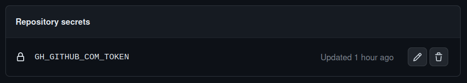
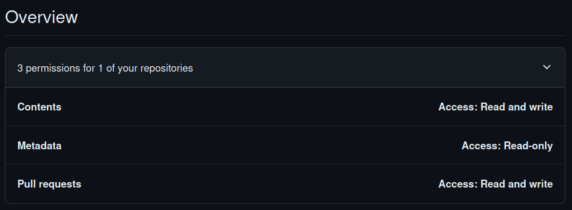
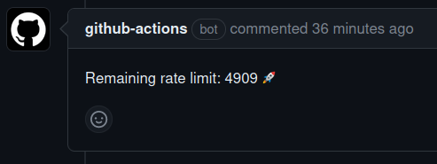
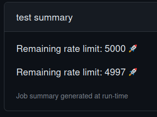

# Check GitHub Rate Limit

This GitHub action displays detailed rate limit information of your GitHub API usage. This information includes the total limit, remaining limit, used limit, time of rate limit reset, and the time remaining until the reset.

## Inputs

### `token`

**Optional** The GitHub token to be used for authenticated requests. If not provided, the action will make unauthenticated requests.

### `sha`
**Optional** Setting this to the built-in `${{ github.event.workflow_run.head_sha }}` allows looking up the PR
associated with the workflow run. This is needed if you want to post a comment with the results to the PR.

### `post_comment`
**Optional** Setting this to `true` will post a comment to the PR with the results. This is only valid if `sha` is
set to the built-in `${{ github.event.workflow_run.head_sha }}`. Requires Content and Pull Request permissions.
Defaults to `false`.

## Usage

Add a step in your GitHub Actions workflow file that uses this action:

```yaml
steps:
  - name: Check rate limit without token
    uses: wakamex/rate-limit-action@master
    with:
      token: ${{ secrets.GH_GITHUB_COM_TOKEN}}
      sha: ${{ github.event.workflow_run.head_sha }}
      post_comment: true
```

## Token Permissions

Note the use of the `GH_GITHUB_COM_TOKEN` secret. This is a secret that you must create in your repository settings
under `/settings/secrets/actions`.



If you want to use the `post_comment` feature, you must also add the following permissions to the token from
[New fine-grained personal access token](https://github.com/settings/personal-access-tokens/new).

- `Contents`
- `Pull requests`



If `post_comment` is set to `true`, the action will post a comment to the PR with the results as well:



## Output

This output is printed in the action log:

```
Rate limit information:
Resource: core
Total limit: 60
Remaining: 50
Used: 10
The rate limit will reset at 2023-07-06 18:22:15 UTC
Time remaining until reset: 3599 seconds (59 minutes)
```

The remaining rate limit is printed to the [test summary](https://github.com/delvtech/elf-simulations/actions/runs/5491337759?pr=640) as well:



This example called the action twice. At the beginning and end of the workflow, which allows you to see the change
over the course of the workflow (note other workflows may be running at the same time, also eating into the rate limit).

## License

The scripts and documentation in this project are released under the [MIT License](LICENSE)
